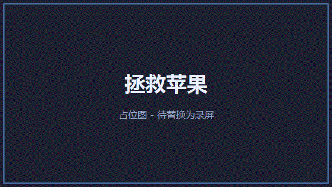
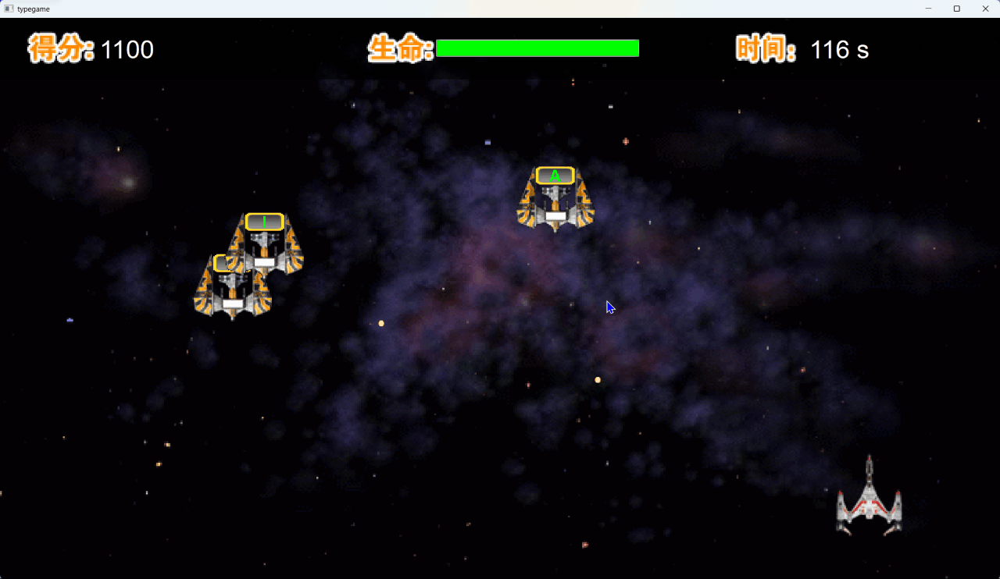

# TypeGame — 打字游戏

基于 Qt5 的 C++ 打字练习游戏，包含「拯救苹果」和「太空大战」两种玩法。

> ## ⚠️ 素材说明（请先读这段）
>
> 本项目所用的**游戏图片与音效均由实习单位在培训期间提供，版权归其所有，
> 未随本仓库分发**。本仓库只包含本人编写的源代码。
>
> 因此直接克隆本仓库后**无法编译运行**：`.qrc` 中原本引用 `image/` 目录的
> 素材已被移除，`image/` 也已在 `.gitignore` 中忽略。
> 如需在本地构建，请自备素材放入 `image/` 目录（保持原有的子目录结构），
> 或在 `res_main.qrc` / `res_game.qrc` 中调整为自有素材。

---

## 演示效果

> 截图与演示录屏由本人本地运行录制，素材版权归原权利人，仅作效果展示。

| 拯救苹果 | 太空大战 |
|---|---|
|  |  |

---

## 构建 & 运行

```bash
# Windows（需要 vcpkg + Qt5）
build_win.bat

# 产物
build\bin\Release\typegame.exe
```

### 命令行测试

```
build\bin\Release\typegame.exe apple --test --input test_config_apple.json --output test_result_apple.json
build\bin\Release\typegame.exe space --test --input test_config_space.json --output test_result_space.json
```

### 单元测试

运行 `run_tests.bat`（8 个 Qt Test 用例）。

### 产物

```
build\bin\Release\typegame.exe          # 主程序
build\test\Release\tst_*.exe            # 单元测试（8 个）
```

---

## 架构设计

```
┌────────────┐
│  main.cpp  │── GameTestRunner ──→ CLI测试模式（--test）
└─────┬──────┘
      │
┌─────▼──────┐
│ MainWindow │  无边框主窗口，自定义标题栏，拖拽移动
└─────┬──────┘
      │ 点击游戏图标
      ├──→ AppleGameWidget   拯救苹果（字母掉落 + 按键消除）
      ├──→ SpaceWarWidget    太空大战（敌机字母 + 子弹追踪）
      ├──→ (预留) 生死时速 / 鼠的故事 / 激流勇进
      │
      ▼ typegame_lib（静态库）
```

### 模块分层

| 层 | 职责 | 文件 |
|---|---|---|
| **入口** | 模式分发（GUI / CLI 测试） | `main.cpp` |
| **窗口** | 无边框主窗口 + 游戏选择 | `mainwindow.*` |
| **游戏** | 拯救苹果核心逻辑 | `applegamewidget.*` |
| | 太空大战核心逻辑 | `spacewarwidget.*` |
| **UI 组件** | 图文按钮（hover 变色） | `buttonwithtext.*` |
| | 三态按钮（Normal/Hover/Press + 音效） | `tristatebutton.*` |
| | 设置弹窗 / 退出确认 / 高分榜 / 昵称输入 | `settingsdialog.*` `exitconfirmdialog.*` `highscoredialog.*` `nameinputdialog.*` |
| **测试** | CLI 集成测试框架（JSON 驱动） | `gametestrunner.*` |
| | Qt Test 单元测试（8 个） | `test/tst_*.cpp` |
| **资源** | 运行时动态注册 .rcc 资源文件 | `respath.h` |

### 资源管理策略

- `res_main.qrc` — 主窗口资源（编译进 exe）
- `res_game.qrc` + `data/word.txt` → **编译为 `res_game.rcc`**（二进制资源文件）
- 启动游戏时通过 `QResource::registerResource()` 动态加载 .rcc
- **好处**：减小主程序体积，游戏资源按需加载
- `res.qrc = res_main.qrc + res_game.qrc` 供单元测试链接使用

### 测试架构

**双层测试体系**：

1. **CLI 集成测试**（`GameTestRunner`）：模拟键盘输入，JSON 配置驱动，支持 `AllCorrect` / `AllWrong` / `WithErrors` 三种模式，输出结构化 JSON 报告
2. **Qt Test 单元测试**（8 个）：覆盖 ButtonWithText、TriStateButton、NameInputDialog、HighScoreDialog、ExitConfirmDialog、AppleGameWidget、SpaceWarWidget、MainWindow

---

## 性能优化

- **渲染**：所有 Pixmap 在构造函数中一次性加载，paintEvent 只做 `drawPixmap()`，无运行时 I/O
- **动画**：使用 Sprite Sheet（单张图片包含多帧），通过 `QPixmap::copy()` 切帧，无逐帧文件读取
- **音效**：短音效用 `QSoundEffect`（低延迟预加载），通过静音 QMediaPlayer 循环保持音频设备热启动消除冷延迟；背景音乐用 `QMediaPlayer` + `EndOfMedia` 信号循环
- **主循环**：统一 33fps 定时器驱动（~30ms 间隔），在一个 tick 内完成生成、移动、碰撞、绘制
- **容器操作**：列表遍历删除使用反向迭代，避免索引偏移
- **布局**：所有尺寸使用屏幕宽高比计算，一次 resizeEvent 重新布局，无布局管理器递归开销
- **随机数**：使用 `QRandomGenerator`（线程安全、无锁），替代旧式 `qrand`
- **测试模式跳过音频**：测试模式下不播放 BGM，加速测试执行

---

## 亮点

- **双层测试体系**：CLI 集成测试 + Qt Test 单元测试，覆盖正向/错误/全错场景
- **LLM 单词生成**：集成 DeepSeek API，异步生成计算机领域英文单词作为奖励单词，带预填充池和频率控制
- **追踪子弹**：子弹使用比例导引法（turn-rate limited），平滑转向追踪目标敌机
- **敌机 AI 两阶段运动**：第一阶段水平飞入 → 第二阶段正弦振荡，呈现有节奏的移动轨迹
- **自定义 UI 组件**：`TriStateButton`（三态 Sprite 切换 + 音效）、`ButtonWithText`（hover 下划线变色），优于 QSS 伪状态
- **无边框窗口**：自定义标题栏 + 拖拽移动 + 最小化/最大化/关闭，视觉风格统一
- **分辨率自适应**：所有元素尺寸基于屏幕比例计算，不同分辨率下布局保持一致
- **渐进难度**：定时自动升级（速度、敌机数量递增），过关后难度提升
- **结构化测试配置**：JSON 输入定义字母序列、游戏参数、测试轮次和错误频率
- **资源按需加载**：.rcc 动态注册，主程序轻量启动

---

## 已知问题

- **API Key 需自备**：`spacewarwidget.cpp` 优先读环境变量 `DEEPSEEK_API_KEY`，仓库中不含任何真实密钥；使用 LLM 奖励单词功能前请自行设置该环境变量
- **主线程网络请求**：LLM API 调用使用 `QNetworkAccessManager`（异步）但未做请求超时/重试处理
- **资源加载无容错**：多处 `pixmap.load()` 未检查返回值，加载失败时静默降级
- **三个游戏入口未实现**：「生死时速」「鼠的故事」「激流勇进」有 UI 按钮但点击无实际功能
- **资源文件冗余**：`res.qrc` 是 `res_main.qrc + res_game.qrc` 的拼接，存在重复定义
- **中文字符串硬编码**：大量 `tr()` 和 `qDebug()` 中包含中文文本，缺少 i18n 基础设施
- **`mainwindow.cpp` 使用 `exit(0)`**：绕过 Qt 正常关闭流程，应改为 `QApplication::quit()`
- **`Ui::MainWindow *ui`**：声明但始终为 `nullptr`，mainwindow.ui 未被使用
